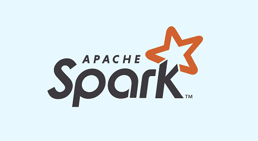

# ☁️ Projet N°7 : Déployez un modèle dans le cloud

## **📌 Contexte et Objectif**

**Entreprise :** Fruits!  
**Logo :**   

### **🎯 Objectif**
Développer une **architecture Big Data évolutive** sur AWS permettant d'identifier les fruits à partir de photos et de préparer une montée en charge des données.

### **📂 Jeux de données**
- 📊 **Données :** [Kaggle](https://www.kaggle.com/datasets/moltean/fruits)  
- 📥 [Téléchargement direct](https://s3.eu-west-1.amazonaws.com/course.oc-static.com/projects/Data_Scientist_P8/fruits.zip)  
- 📜 **Notebook initial** : [Notebook de l'alternant](https://s3.eu-west-1.amazonaws.com/course.oc-static.com/projects/Data_Scientist_P8/Mode_ope%CC%81ratoire.zip)  

### **🔍 Missions**
✅ **Finaliser et compléter la chaîne de traitement initiée par l'alternant**  
✅ **Développer un pipeline Big Data évolutif** en PySpark sur **AWS EMR**  
✅ **Implémenter un traitement de diffusion des poids du modèle** pour le déploiement  
✅ **Ajouter une réduction de dimension avec PCA** pour optimiser le stockage  

### **⚠️ Contraintes**
- **Cloud AWS** : utilisation des services **EMR, S3, IAM**  
- **RGPD** : Localisation des données en **Paris (eu-west-3)**  
- **PySpark** : Optimisation et parallélisation des traitements  

---

## **🚀 Réalisations et Méthodologie**

### **1️⃣ Préparation et Chargement des Données**
- 📂 **Ouverture et chargement des images**
- 🗂 **Extraction des liens d'images** et des **noms des dossiers** correspondant aux catégories de fruits  

---

### **2️⃣ Extraction des Caractéristiques via Réseau de Neurones**
- **Chargement du modèle pré-entraîné MobilNetV2**
- Suppression des **deux dernières couches du réseau** pour récupérer uniquement les features  
- **Extraction des caractéristiques des images** sous forme de vecteurs  

---

### **3️⃣ Réduction de Dimension avec PCA**
- Implémentation d'un **PCA en PySpark** pour réduire le volume des features  

📉 **Réduction des dimensions tout en conservant l’essentiel de l’information**  
  

---

### **4️⃣ Stockage et Déploiement Cloud AWS**
✅ Enregistrement des données extraites **au format Parquet**  
✅ Stockage des données et images sur **AWS S3**  
✅ Passage sur une architecture **AWS EMR (Elastic MapReduce)** pour traiter de gros volumes  

🚀 **Déploiement sur AWS :**  
  
  

---

## **🛠️ Technologies et Outils Utilisés**
- **Langage :** Python 🐍  
- **Big Data :** PySpark  
- **Deep Learning :** TensorFlow, MobilNetV2  
- **Cloud AWS :** S3, EMR, IAM  
- **Optimisation :** PCA pour la réduction de dimension  

---

## **📬 Contact et Feedback**
💡 Ce projet a été réalisé dans le cadre de ma **formation Data Science**. N’hésitez pas à **laisser vos suggestions** ou à **me contacter** pour en discuter !  

📩 **Contact :**  
📧 [johan.rocheteau@hotmail.fr](mailto:johan.rocheteau@hotmail.fr)  
🔗 [LinkedIn](https://www.linkedin.com/in/johan-rocheteau)
